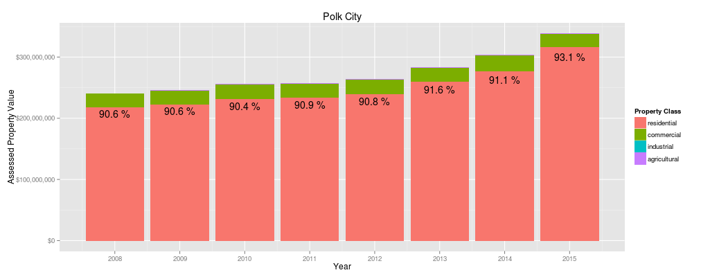

## Introduction

I live in Polk City, Iowa, US, a town of about 4,000 people in Polk County in central Iowa.

Iowa municipalities derive a significant portion of their income from property taxes levied on real property. (Polk City also receives significant revenue from a local option sales tax.)

For property tax purposes, property is classified as one of:

* Residential
* Commercial
* Industrial
* Agricultural

I was curious about how Polk City's property tax base compares to other cities in Polk County.

---

## Why does property classification matter?

In Iowa, property other than agricultural property is assessed at 100% of market value, and agricultural property is assessed at 100% of productivity and net earning capacity value.

However, the value that is actually taxed is determined after applying "rollbacks" which vary over time and by property class. Here are the rollbacks for the 5 most recent years available. These percentages apply statewide.

<table>
<tr><th>Year</th><th>Residential</th><th>Commercial</th><th>Industrial</th><th>Agricultural</th></tr>
<tr><td>2010</td><td>48.5299%</td><td>100%</td><td>100%</td><td>69.0152%</td></tr>
<tr><td>2011</td><td>50.7518%</td><td>100%</td><td>100%</td><td>57.5411%</td></tr>
<tr><td>2012</td><td>52.8166%</td><td>100%</td><td>100%</td><td>59.9334%</td></tr>
<tr><td>2013</td><td>54.4002%</td><td>95%</td><td>95%</td><td>43.3997%</td></tr>
<tr><td>2014</td><td>55.7335%</td><td>90%</td><td>90%</td><td>44.7021%</td></tr>
</table>

For example, a home valued at $200,000 in 2014 would have a taxable value of 55.7335% x $200,000 or $111,467.

Source: [Iowa Department of Revenue](https://tax.iowa.gov/equalization-and-rollbacks)

---

## What's a healthy mix of property classes?

Cities use tax revenue to provide **essential services** such as police and fire protection, streets and sidewalks, water and sewer and other services to their residents. They also provide **amenities** such as parks, libraries, recreation trails, and sports facilities.

A tax base with a healthy percentage of **commercial** and **industrial** property can mean more revenue available for **amenities** for two reasons:

1. Non-residential property generally generates more tax revenue per capita because it doesn't increase population
2. Commercial and industrial property is subject to lower "rollbacks" and therefore effectively taxed at higher rates

Of course, non-residential property still requires police, fire, streets, water, sewer, and other services.

---

## Is Polk City's property tax base too dependent on residential property?

Polk City's tax base looks like this:

As a resident of Polk City, I wondered how we compared to other nearby cities.

[Click here to see what I found out.](https://davidbody.shinyapps.io/polk-city-tax-base)
